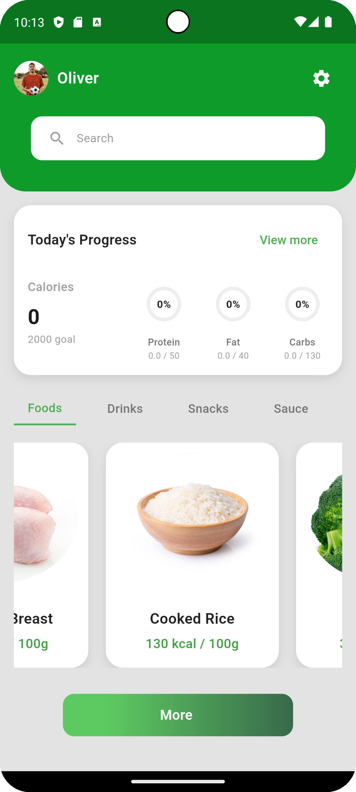
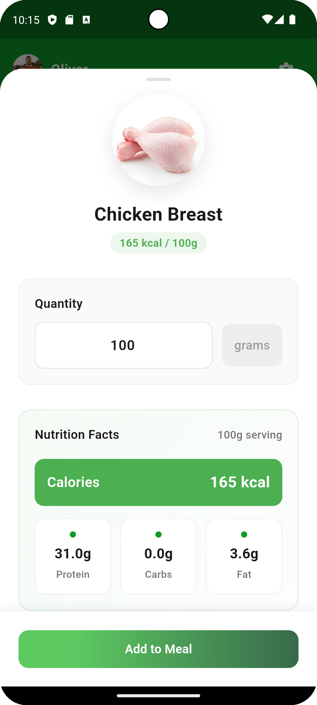
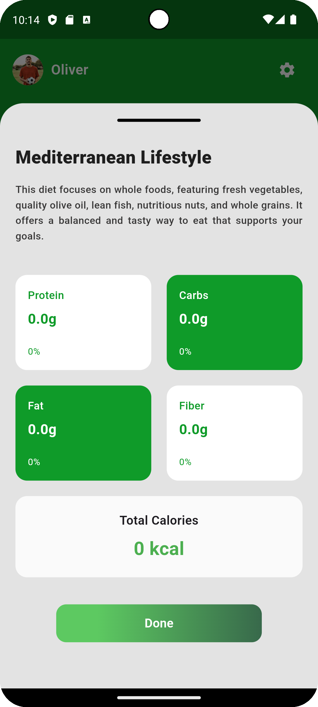

# 🍎 NutriFit

NutriFit is a simple **Flutter application** that lets users compose a meal from a small list of ingredients and shows the total macros (kcal, protein, carbs, fat).  
It is designed for the **intern-project case study**.

---

## 🚀 Features
- Select ingredients from a predefined JSON dataset.
- Enter grams for each ingredient.
- Automatically calculate macros:
  ```
  total = (per-100g value × grams) / 100
  ```
- Show running totals for kcal, protein, carbs, and fat.
- Clean UI with a single main screen, modular widgets.
- State management powered by **Riverpod**.

---

## 🏗️ Project Structure
```
lib/
 ├── models/         # Ingredient, MealEntry
 ├── providers/      # Riverpod providers (state management)
 ├── screens/        # Main screen
 ├── widgets/        # Reusable widgets (ingredient cards, totals bar)
 ├── constants.dart  # Colors, dataset path, global constants
 └── main.dart       # Entry point
```

---

## ⚙️ Installation

### 1️⃣ Install Flutter & Dart
- [Download Flutter SDK](https://docs.flutter.dev/get-started/install/windows)  
- Add Flutter to PATH and verify with:
  ```bash
  flutter doctor
  ```

### 2️⃣ Clone Repository
```bash
git clone https://github.com/youssefyasser2/intern-project.git
cd intern-project
```

### 3️⃣ Install Dependencies
```bash
flutter pub get
```

### 4️⃣ Run Application
```bash
flutter run
```

---

## 📊 Dataset
The file `intern-case-1.json` contains the ingredient list and macros per 100g.  
It is loaded in the app through the constants and parsed into models.

---

## 🎬 Demo Video

> **Note:** GitHub README cannot play videos directly from MEGA.  
> You can download and watch the video using the link below:

[Download and watch the demo video](https://mega.nz/file/2RR3GYbS#Byohp2M0cj44lb2HM5Wc_0TOn_zMrskkT4s2i--oO2Y)


---


## 📸 Screenshots
| Ingredient List | Add Grams                                 | Totals                                   |
|-----------------|-------------------------------------------|------------------------------------------|
|  |  |  |

---
